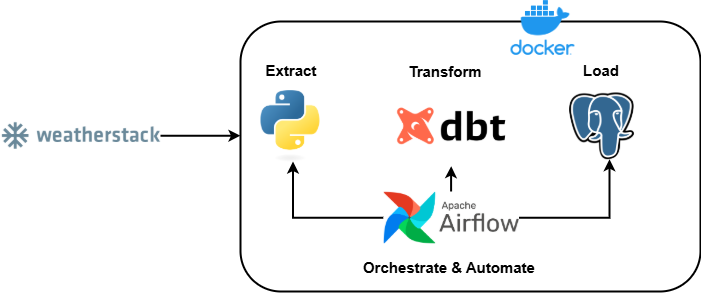

#  Weather Data ETL Pipeline

This project implements a containerized ETL pipeline using **Python**, **DBT**, **PostgreSQL**, and **Apache Airflow**, designed to fetch and process real-time weather data from the [Weatherstack API](https://weatherstack.com/).

---

## 📊 Architecture Overview



###  Pipeline Flow

1. **Extract**  
   Python scripts retrieve real-time weather data from the Weatherstack API.

2. **Transform**  
   DBT transforms raw weather data into structured models suitable for analytics.

3. **Load**  
   Cleaned data is loaded into a PostgreSQL data warehouse.

4. **Orchestrate & Automate**  
   Apache Airflow automates and schedules the ETL pipeline.

5. **Containerized**  
   Docker runs each component in isolated environments for portability and reproducibility.

---

##  Tech Stack

| Component       | Tool             |
|-----------------|------------------|
| Data Source     | Weatherstack API |
| Extraction      | Python           |
| Transformation  | DBT              |
| Data Warehouse  | PostgreSQL       |
| Orchestration   | Apache Airflow   |
| Containerization| Docker           |

---

##  Project Structure

```plaintext
weather-data-project/
├── README.md                 # Documentation
├── dbt_etl_architect.png     # Architecture diagram
├── airflow/                  # Airflow DAGs and configuration
├── api-request/              # Python extract scripts
├── dbt/                      # DBT models and configs
├── postgres/                 # PostgreSQL setup (init SQL, volumes)
├── docker-compose.yml        # Docker Compose orchestration
└── requirements.txt          # Python dependencies
```
##  Clone the Repository

```bash
git clone https://github.com/bassamoh32/dbt-pipeline.git
cd dbt-pipeline
```
## Configure Environment Variables
Create a .env file in the root directory 

```env
# .env
api_key= "your_weatherstack_api_key"
```